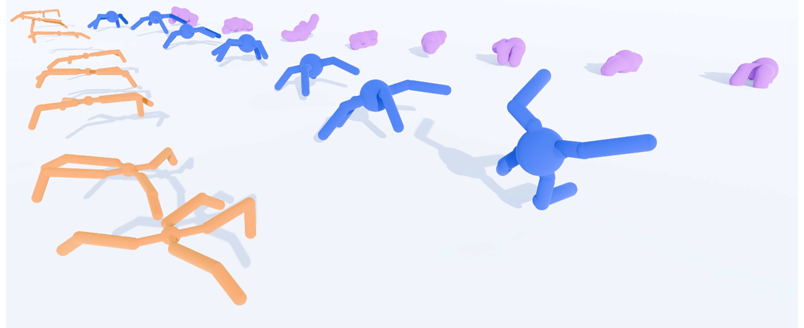
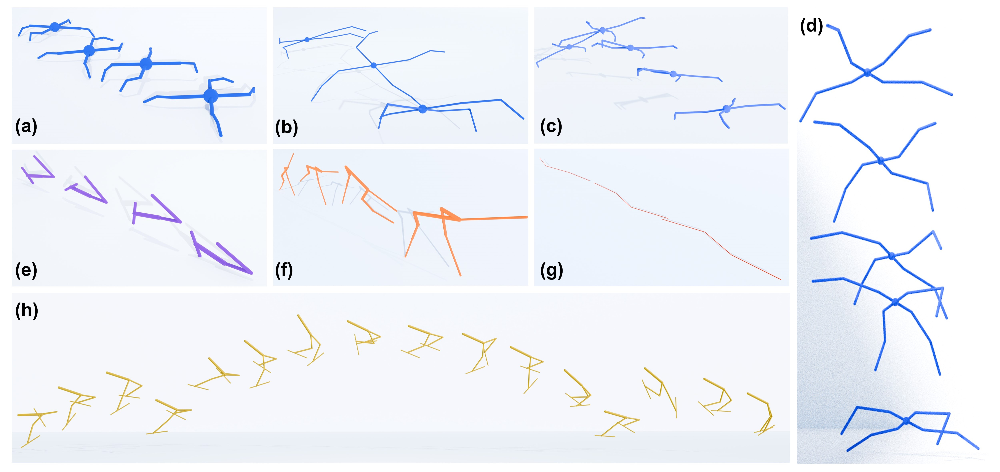

# RoboMoRe
**RoboMoRe: LLM-based Robot Co-design via Joint Optimization of Morphology and Reward**





# Installation
We have tested on Ubuntu 20.04 and 22.04.

Create a new conda environment and install required packages:
    ```
    conda create -n robomore python=3.8
    conda activate robomore
    pip install -r requirements.txt
    ```

# Getting Started
Enter the corresponding task folder and run jupyter notebook:

robodesign_div_m25r5.ipynb: represents RoboMoRe (with diversity reflection)

robodesign_nodiv_m25r5.ipynb: represents RoboMoRe (without diversity reflection)

robodesign_random_m25r5.ipynb: represents RoboMoRe (without random sampling)

robodesign_div_m25r5-fineonly.ipynb: represents RoboMoRe (fine stage only)

# Visualization
We visualize our robots on the blender. We provide a customized script to transfer mujoco robot to blender and will open-source it if you are interested.


# License
This codebase is released under [MIT License](LICENSE).

# Citation
If you find our work useful, please consider citing us!

